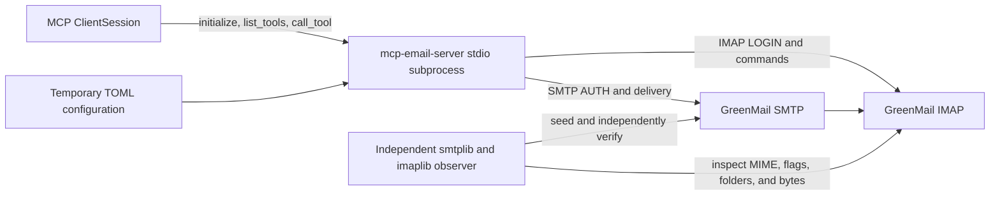

# Validation

> This page validates the current source checkout. Published packages may lag
> development-branch behavior; see
> [Version availability](getting-started.md#version-availability).

The repository includes a Docker-backed black-box baseline for the current
application. It verifies that the installed MCP stdio server can communicate
with real SMTP and IMAP sockets before architecture changes are accepted.

## Run the baseline

Requirements:

- Docker Engine with Docker Compose v2.
- The development environment installed with `uv sync` or `make install`.

Run:

```bash
make test-e2e
```

The command creates a unique Compose project, publishes SMTP and IMAP on
dynamic loopback ports, waits by performing authenticated connections, runs the
E2E test, and removes only that run's container and network even when the test
fails. Concurrent runs and separate worktrees do not share lifecycle ownership.
Each MCP request has a 15-second response deadline so a live but unresponsive
stdio subprocess fails the test instead of hanging indefinitely. The run does
not modify the normal user configuration.

The regular test suite excludes tests marked `e2e` and remains independent of
Docker:

```bash
make test
```

## Automated coverage policy

`make test` measures statement and branch coverage for `mcp_email_server`,
including instrumented Python subprocesses started by the raw stdio and CLI
tests. Coverage data from those processes is combined into the same XML report
as in-process tests, so process-boundary behavior is not treated as unexecuted
code.

The complete local suite enforces an 80% aggregate minimum through the pytest
coverage configuration and the Main workflow. There is no external Codecov gate.
This is an enforceable baseline, not a ceiling: changes should test meaningful
success, failure, and security boundaries rather than add assertions solely to
reach a percentage.
The baseline can be raised as coverage improves without excluding production
modules from measurement.

A deliberately focused coverage run does not represent the complete project and
may override the aggregate gate for diagnosis:

```bash
uv run pytest tests/test_stdio_protocol.py --cov --cov-fail-under=0
```

## Local UI and package validation

Changes to the management UI run three layers in the regular suite:

1. React lint, TypeScript checking, unit tests (including email/password-first
   account setup, progressive disclosure of advanced and optional outgoing mail,
   absence of a redundant connection preview, domain-based editable connection
   suggestions, synchronized untouched security ports, individual
   recipient/sender item editing with distinct empty semantics, hidden no-action
   empty/settled status, task-language conflict presentation, explicit checkbox-bound
   import confirmation, password-state lifetime, and cleanup recovery after the
   last active account is removed), and deterministic Vite staging
   through `make frontend`; the checked-in `frontend/embedded-assets.json` binds
   the frontend sources and staging script to exact packaged asset hashes so
   `make frontend-check` also works without Node or `frontend/dist`;
2. backend route tests for one-time bootstrap, replay/expiry/concurrency/rate
   limiting, exact Host/Origin, CSRF, Fetch Metadata, JSON/body bounds, strict
   headers, logout/shutdown, CSRF-protected default initialization with bootstrap
   revision checks, explicit management DTOs, revision summaries, bounded error
   categories with fixed safe messages, access-log field allowlisting, and
   absence of provider-connectivity, mail, and generic routes;
3. distribution tests that inventory wheel and sdist assets, rebuild a wheel
   from the sdist with failing `node`/`npm` shims, compare static hashes, install
   the wheel into an isolated environment, and serve the authenticated UI on an
   ephemeral loopback port.

Critical browser flows are exercised with locked Playwright/Chromium against a
real CLI process launched under a PTY: fragment removal and bootstrap exchange,
cookie-session reload, stale-link replay, empty-install automatic managed
initialization, v1-safe earlier-settings import preparation that keeps legacy selected, the two-destination
account-first navigation, email-and-password-first account creation with editable
server suggestions, folded advanced/outgoing settings without a connection
preview, pause/enable/edit/removal, per-account **Password** rotation, individual
policy-item editing and both empty states, policy revision propagation, immediate
account usability without catalog activation, successful-import automatic cutover
and restart guidance, hidden no-action empty/settled status, task-language conflict review, progressively disclosed
effective-source import preview and checkbox-confirmed apply, secret-state
clearing, logout, and process shutdown. Run:

```bash
cd frontend && npx playwright install chromium
make test-browser
```

The browser gate runs on a POSIX host and requires the `script` PTY utility
(`util-linux` on the CI runner). The test uses only synthetic credentials, a
temporary file-backed test keyring,
and private temporary catalog paths. Screenshots, video, and traces are disabled
so one-time launch material cannot enter browser artifacts.

## Continuous integration

The main GitHub Actions workflow runs quality checks, a strict documentation
build, the Python version matrix, a dedicated native `windows-latest` job, the locked frontend build with staged-asset
drift rejection, locked-Chromium browser E2E, and GreenMail once on
`ubuntu-latest` for every pull request and push to `main`. A dedicated container
job builds the restricted runtime image and checks its version, absence of source
and build inputs, raw initialization, stdout purity, and exact MCP tool catalog.
A dedicated artifact job runs the same authoritative `make build` then
`make verify-dist` sequence as the release workflow, so CI validates one exact
wheel/sdist pair rather than independent temporary builds only. The GreenMail job has a 10-minute outer
timeout in addition to the per-request MCP deadline. The regular Python
3.11-3.14 test matrix continues to exclude the `e2e` marker, so GreenMail is not
repeated for every interpreter version. The Windows job installs the conditional
`pywin32` dependency, creates a protected-DACL test workspace, runs the full
Python suite without coverage instrumentation and runs the type checker, then
reruns `tests/test_windows_security.py` with explicit reporting on the runner's
real local NTFS workspace. The portable Python matrix owns coverage reporting;
the Windows job is an uncompromised native-behavior gate. Native cases cover
file/directory symlinks, a Developer-
Mode-independent junction, hard links, owner/DACL policy, lock contention and
killed-owner release, concurrent and crash-boundary replacement, complete-old-
or-new atomicity, validated stale cleanup, managed bootstrap/catalog plus
the private SQLite secret store, explicit attachment preflight, default private
attachment-directory creation below a shared Downloads ancestor, and spill
lifecycle. A missing
symlink privilege fails the native gate distinctly; symlink, junction, DACL,
lock, crash, and atomic-write coverage may not be replaced by mocks.

The release workflow verifies the exact
peeled tag commit, validates canonical `X.Y.Z` with an optional `v` prefix, and
deterministically stamps the normalized value into only the isolated release jobs'
Python package metadata and
matching editable lock entry. It then reruns Python 3.11-3.14 against the stamped
release tree. Plugin versions are independent and are not rewritten by an
application release. A separate validation job repeats the frontend, static,
default-Python, docs, browser, package, and GreenMail gates, builds `dist/` once,
and runs `make verify-dist` against those exact wheel/sdist bytes. Verification
includes authenticated UI smoke from both
the wheel rebuilt from the sdist without Node and the original release wheel.
The same stamped release tree also builds and verifies the native container
before publication is authorized. After all Python, frontend, documentation,
E2E, package, and container gates pass, a separate `packages: write` job rebuilds
that exact Dockerfile for Linux `amd64` and `arm64` and publishes the normalized
release version plus `latest` to `ghcr.io/wh1isper/mcp-email-server`. The
credential-bearing Python publish job receives only the checksum-verified
artifacts and cannot rebuild them.

The management CLI contract suite invokes every finite `config` and `account`
command plus reset and credential migration in JSON mode. It parses the complete
stdout as one document and checks `schema_version: 1`, command identity, success,
post-operation revisions/restart state, explicit data/warnings, secret absence,
typed error codes with fixed safe messages, and nonzero single-document
validation failures. Catalog mutation tests prove committed result DTOs are
used without a fallible post-write status read. It also proves JSON does not grant command authority and
secret writes consume only user-controlled stdin. A migration cleanup regression verifies that JSON exposes counts and
warning codes without keyring entry locators. Connectivity tests use a real managed catalog for the missing-SMTP preflight
and typed provider failures for authentication, timeout, and transport categories.
They cover the low-level `account test` CLI while the Web route inventory proves
that provider connectivity is not exposed there. Web logging regressions assert
that only fixed operation id, bounded method, status, and duration are emitted,
with no route/path/URL/query/body/identity/token/secret/exception text.

The normal test suite also launches a raw newline-delimited JSON-RPC harness
without the MCP client SDK. It checks installed application-version identity,
initialization and exact catalog serialization (including annotations), account
discovery text/structured equivalence, stdout purity, malformed UTF-8/JSON and
oversized-frame recovery, cancellation propagation, idle and in-flight EOF, and
process-owned artifact
cleanup.

Run the baseline locally before pushing relevant mail or stdio changes; the
shared CI check is not a replacement for local diagnosis.

## Tested boundary



The test starts the installed `mcp-email-server` console script as a child
process rather than importing tool functions. The subprocess loads a temporary
plaintext TOML file containing only synthetic test credentials. Python's
standard-library `smtplib`, `imaplib`, and MIME parser act as an independent
seeder and observer, so the system is not solely verifying itself.

## GreenMail coverage

| Area          | Assertions                                                                                                           |
| ------------- | -------------------------------------------------------------------------------------------------------------------- |
| MCP lifecycle | stdio subprocess starts, `initialize` succeeds, and expected tools are visible                                       |
| Configuration | v1 TOML compatibility, direct fresh init, reviewed import cutover, explicit recovery selection, and restart          |
| Managed mode  | a Linux/Windows SQLite-secret managed account reaches live IMAP; a missing selected database fails without fallback  |
| SMTP          | authenticated Alice-to-Bob delivery succeeds through `send_email`                                                    |
| IMAP read     | Bob can list paged metadata with exact totals and retrieve full content by UID                                       |
| Attachments   | source bytes arrive in Bob's MIME message, appear in full content, download to disk, and match exactly               |
| Sent copy     | Alice receives the application-created copy in `Sent`                                                                |
| Flags         | focused mark-read adds `\\Seen`; generic flag mutation removes `\\Seen` and adds `\\Flagged`; drafts retain defaults |
| Mailboxes     | the observer provisions `Sent`, `Drafts`, and `Archive`; MCP discovers and uses them                                 |
| Index         | initial projection, qualified SQLite reuse, filter fallback, bounds, and restart reuse are verified                  |
| Mutations     | explicit move, automatic archive selection, draft save, and delete are observed in IMAP                              |

`list_emails_metadata` currently fetches headers only and therefore returns an
empty attachment list. Attachment names are verified through
`get_emails_content`, which fetches and parses the complete MIME message. The
baseline records this existing contract rather than silently changing it.
The E2E suite also inspects only non-secret projection state to verify that a
complete five-message mailbox is persisted once, reused for a second page, and
reused after restarting the packaged stdio process. Subject, address, flag,
body, text, and attachment-filter requests exercise the application-owned IMAP
fallback with exact totals, and an oversized page is rejected at the MCP schema
boundary.

## Isolation and security

The Compose definition:

- pins GreenMail 2.1.11 by both tag and image digest;
- exposes only SMTP and IMAP on dynamically assigned loopback ports;
- gives each invocation a unique Compose project so concurrent cleanup cannot affect another run;
- uses only `example.test` addresses and fixed synthetic passwords;
- disables implicit TLS only inside this local test boundary; and
- never forwards messages to external mail servers.

The application configuration lives in a pytest-managed temporary directory
and contains only the fixed synthetic credentials above. Windows native tests
use only the ephemeral runner account, a protected local NTFS test container,
private SQLite synthetic credentials, and bounded identity-validated cleanup.
Managed Linux credentials remain in the temporary owner-only catalog SQLite
database. The
suite also injects a test-only, process-persistent keyring backend for legacy
keyring and import scenarios; its file is confined to the same directory.
Production managed mode has no TOML plaintext fallback. Do not replace the
synthetic accounts with real credentials or personal message data.

## Why GreenMail

[GreenMail](https://greenmail-mail-test.github.io/greenmail/) is designed as a
sandbox mail server for integration tests and provides SMTP and IMAP with a
small, deterministic setup. The repository uses the official
[`greenmail/standalone`](https://hub.docker.com/r/greenmail/standalone) image.

GreenMail is a compatibility baseline, not proof against every provider. This
baseline also does not cover implicit TLS or STARTTLS; those paths retain their
focused unit tests until a dedicated certificate-backed integration service is
added. A future nightly matrix can add a production-oriented server such as
[Stalwart](https://stalw.art/docs/install/platform/docker/) and targeted canary
accounts for provider-specific behavior. Real-provider canaries must use
separate test accounts, minimal retention, and credentials supplied outside the
repository.

## Troubleshooting

The runner prints its unique Compose project name and assigned ports. If a run
is interrupted before cleanup completes, list matching projects with:

```bash
docker compose ls --all | grep mcp-email-server-e2e
```

Use the printed project name to inspect logs or remove only that run:

```bash
docker compose \
  --project-name <printed-project-name> \
  --file dev/greenmail/compose.yml \
  logs greenmail

docker compose \
  --project-name <printed-project-name> \
  --file dev/greenmail/compose.yml \
  down --volumes --remove-orphans
```
